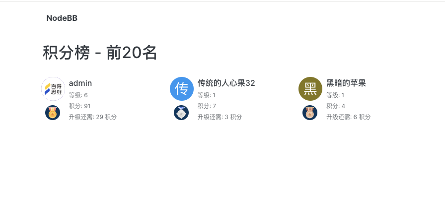
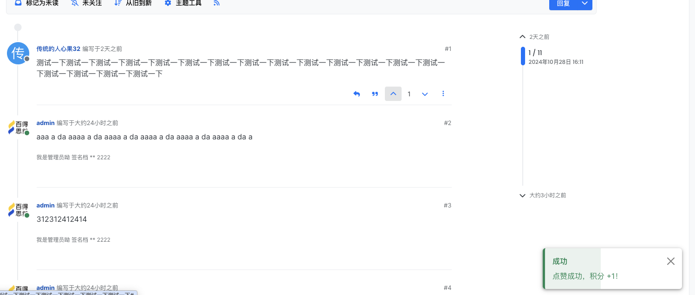
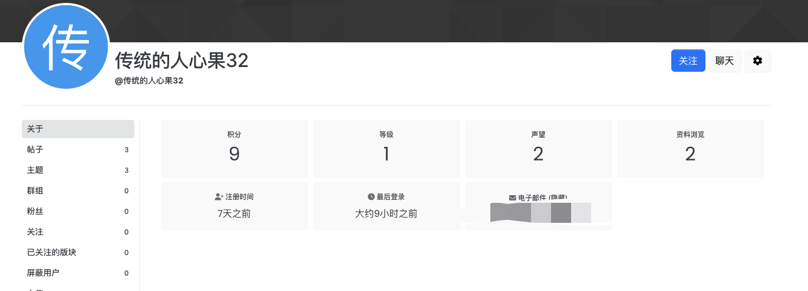
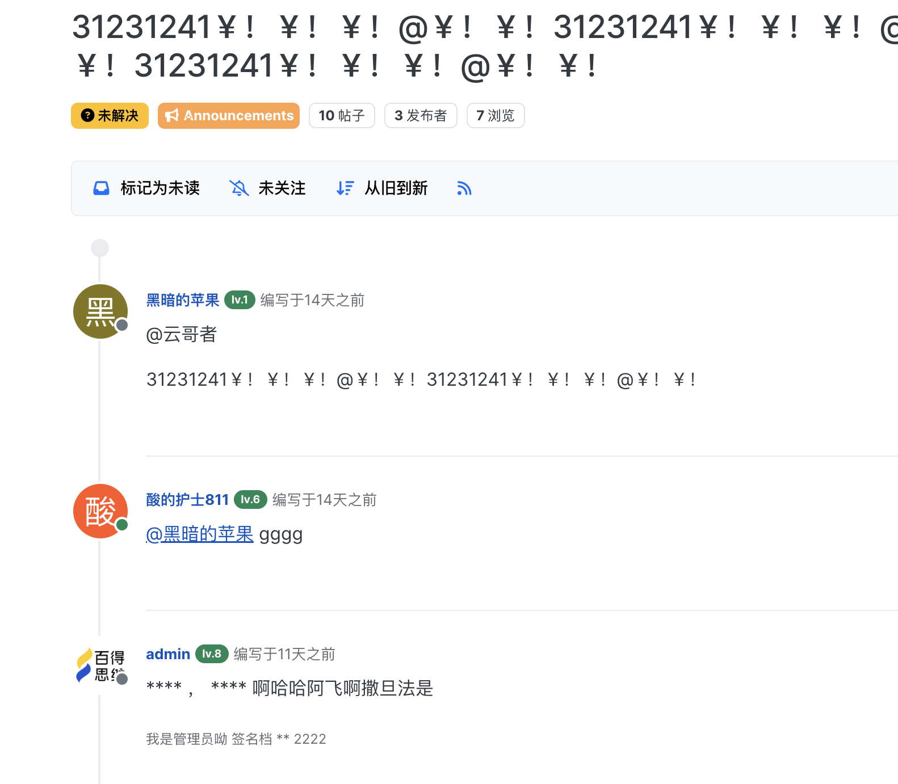

# NodeBB: Points

Additional metrics for User Profiles. It's like experience in video games. Plugin is good for gamification of your board.

## 我做的改动

1. 优化积分管理页面和积分排行榜的布局样式
2. 兼容`NodeBB v3`版本
3. 点赞、发帖、回复时增加`alert`提示
4. 增加积分变动日志记录，点击用户主页积分可以查看
5. 用户主页增加积分和等级字段
6. 文案改为中文
7. 记得在后台控制面板中将积分榜添加到导航栏中，不然不会显示积分排行榜
8. 签到获取积分
9. topic 主题页显示用户等级
10. 排行榜显示当前用户的排名






<!-- START doctoc generated TOC please keep comment here to allow auto update -->
<!-- DON'T EDIT THIS SECTION, INSTEAD RE-RUN doctoc TO UPDATE -->

- [The Ranking Calculation](#the-ranking-calculation)
- [Themes](#themes)
  - [Profile View](#profile-view)
  - [Topic View](#topic-view)

<!-- END doctoc generated TOC please keep comment here to allow auto update -->

## The Ranking Calculation

The Ranking calculator is a function, that should accept 2 parameters - settings and raw points.
Settings could vary from one calculator to another. Calculator must return object with properties listed below:

- `rank` [Number] - user's rank, level
- `rankProgress` [Number] - amount of points on current level
- `rankTotal` [Number] - amount of points needed to level-up
- `total` [Number] - raw amount of points

Example: [Default Function](https://github.com/NicolasSiver/nodebb-plugin-ns-points/blob/f34a4cf6c69b4c8b1abbf88efc3a0f1d8ad6fcf2/public/js/ranking.js#L9-L27)

## Themes

Plugin populates both: `Profile` and `Topic` views. Search for `points` property in corresponding entities.
Don't forget to add link on _overview_ page, link should look like - `/points`

### Profile View

If you want points in Profile, do very basic changes to your theme:

> Example: Persona Theme, `v4`, find `templates/account/profile.tpl`, edit template in package directory - `node_modules`

Find block that is responsible for [stats](https://github.com/NodeBB/nodebb-theme-persona/blob/4c32d4b0b16711bde6ee84d6b18dfb13dbfc24c0/templates/account/profile.tpl#L14-L41), and insert template where you want:

```html
<div class="account-stats">
  ...

  <!-- IMPORT partials/points_profile.tpl -->

  ...
</div>
```

### Topic View

Every post will have additional field: `points`.
If you want utilize points calculation feature in topic view, you should use theme that supports such type of integration.
